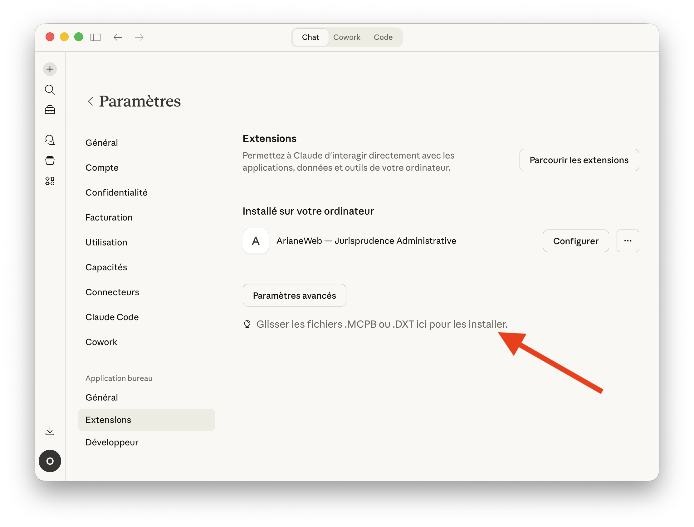
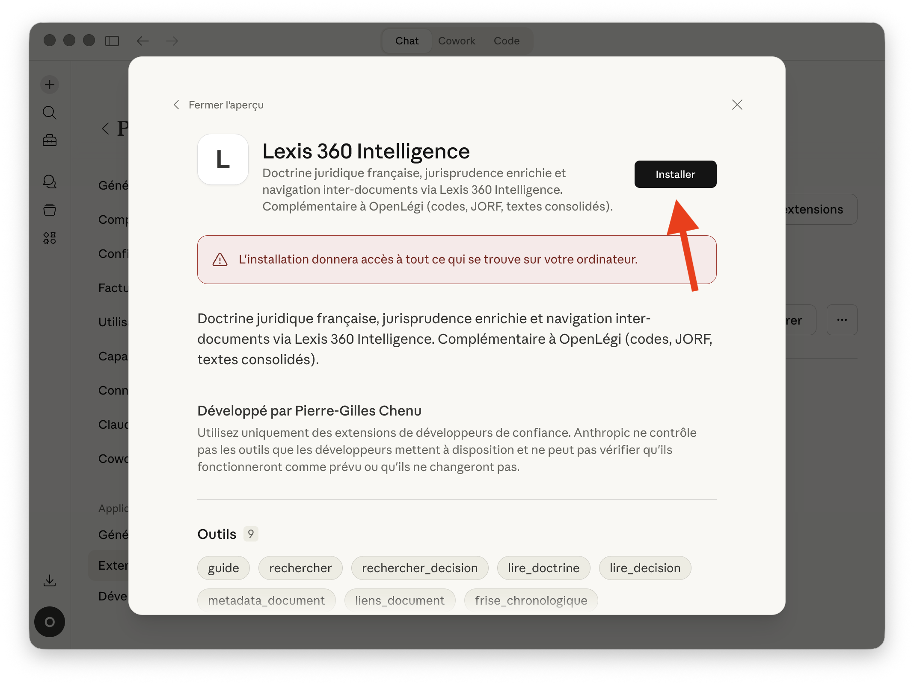
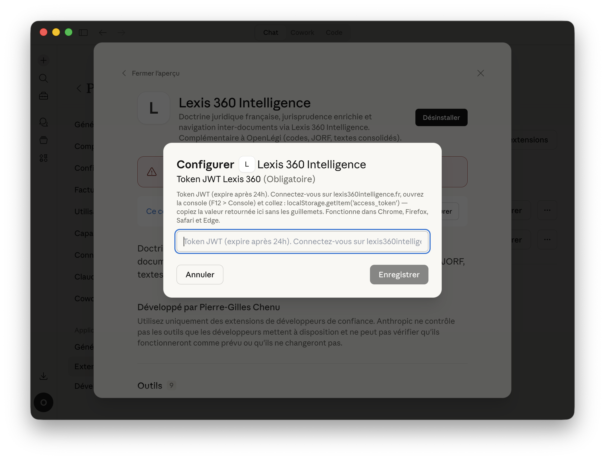
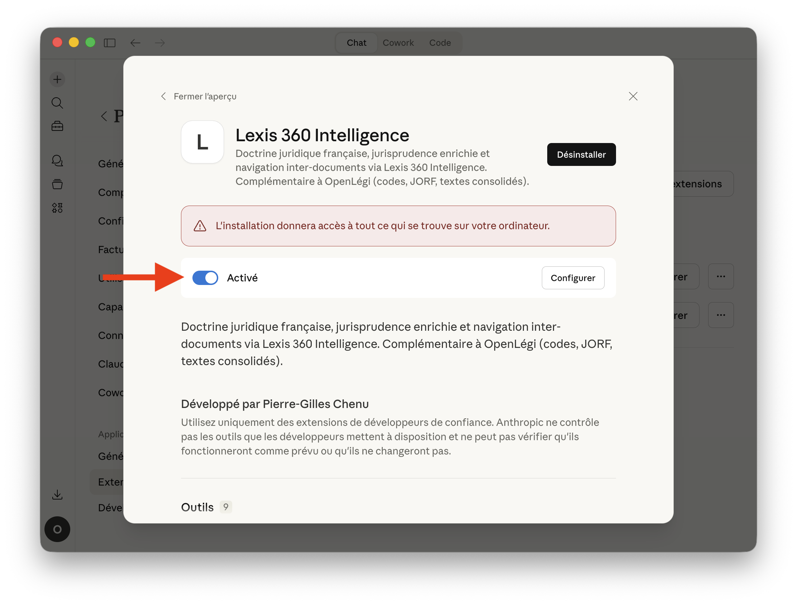
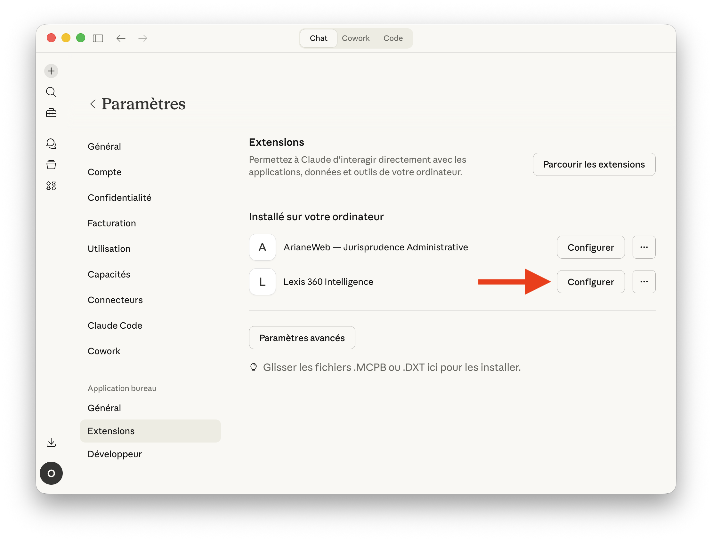
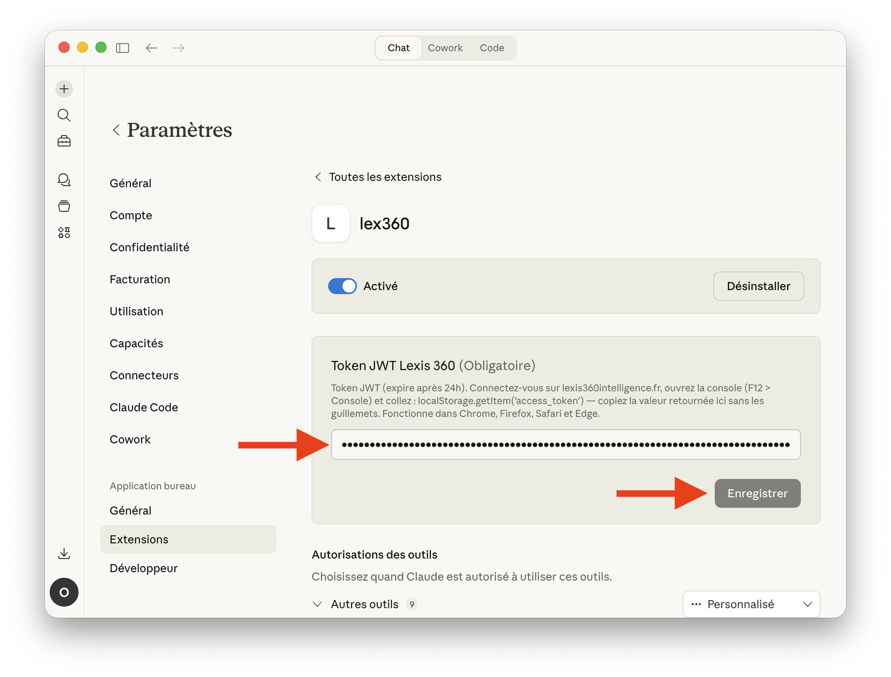

# Installation de l'extension lex360 pour Claude Desktop

## Prérequis

- [Claude Desktop](https://claude.ai/download) installé
- Un compte [Lexis 360 Intelligence](https://www.lexis360intelligence.fr/) actif

## Étape 1 — Télécharger le fichier `.mcpb`

Récupérez `lex360-0.1.0.mcpb` depuis les [releases](.).

## Étape 2 — Ouvrir les extensions Claude Desktop

Dans Claude Desktop, allez dans **Paramètres > Extensions**. Vous verrez la zone de dépôt en bas de la page :

> *Glisser les fichiers .MCPB ou .DXT ici pour les installer.*



## Étape 3 — Installer l'extension

Glissez le fichier `lex360-0.1.0.mcpb` dans la zone de dépôt. Claude Desktop affiche un aperçu de l'extension avec ses 9 outils. Cliquez **Installer**.



## Étape 4 — Configurer le token JWT

Après l'installation, Claude Desktop vous demande le token JWT. Pour le récupérer :

1. Connectez-vous sur [lexis360intelligence.fr](https://www.lexis360intelligence.fr/)
2. Ouvrez la console du navigateur (`F12` > onglet **Console**)
3. Collez cette commande :
   ```js
   localStorage.getItem('access_token')
   ```
4. Copiez la valeur retournée **sans les guillemets**

Collez le token dans le champ et cliquez **Enregistrer**.



## Étape 5 — Vérifier l'activation

L'extension doit afficher **Activé** avec le toggle bleu. Vous pouvez maintenant utiliser les outils lex360 dans vos conversations Claude.



---

## Renouveler le token

Le token JWT expire après **24 heures**. Quand les outils retournent une erreur « Token expiré », il faut le mettre à jour.

### 1. Accéder à la configuration

Dans **Paramètres > Extensions**, cliquez **Configurer** à côté de Lexis 360 Intelligence.



### 2. Coller le nouveau token

Récupérez un nouveau token depuis la console du navigateur (même procédure qu'à l'étape 4), collez-le dans le champ et cliquez **Enregistrer**.


