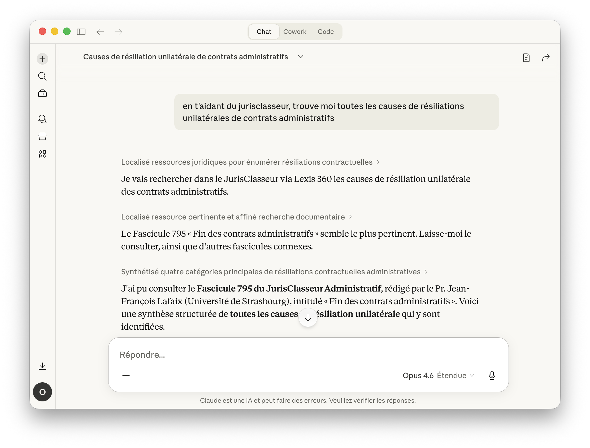
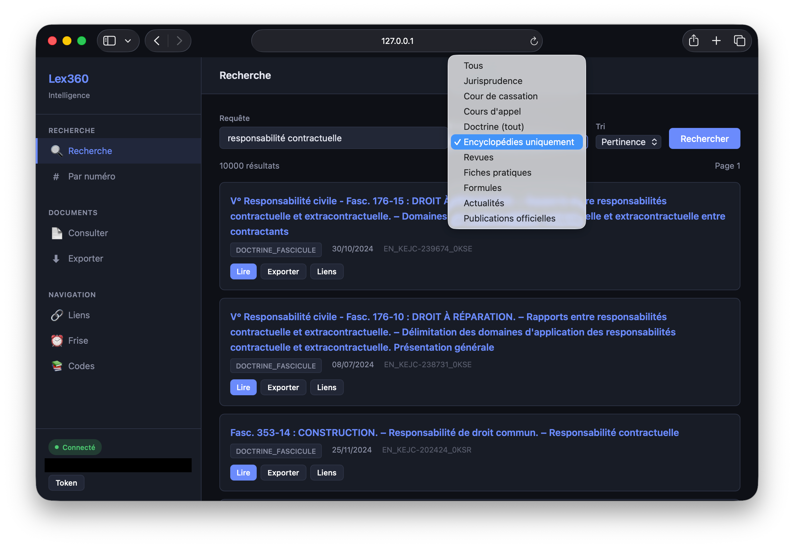
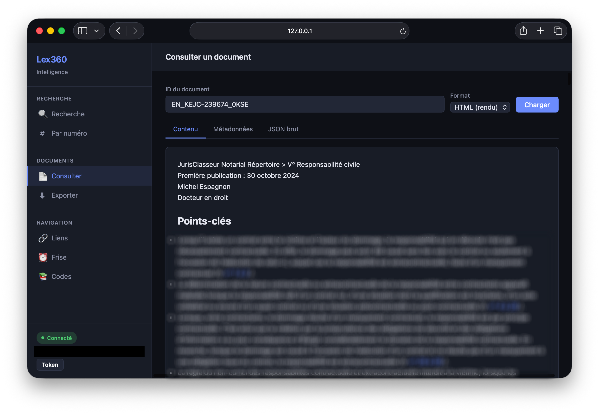

<p align="center">
  
</p>

# lex360

Client Python pour l'API privée de [Lexis 360 Intelligence](https://www.lexis360intelligence.fr/) (LexisNexis France).

Compatible **macOS**, **Linux** et **Windows**.

## Extension MCP pour Claude

Installez l'extension MCP (`.mcpb`) dans Claude Desktop et accédez directement à la doctrine, la jurisprudence, les codes annotés et la navigation Lexis 360 depuis une conversation Claude.



### Installation rapide

1. Télécharger `lex360-0.3.0.mcpb` depuis les [releases](./releases/)
2. Glisser le fichier dans **Paramètres > Extensions** de Claude Desktop
3. Coller votre token JWT et cliquer **Enregistrer**

Fonctionne sur macOS, Linux et Windows (Claude Desktop + Python 3.11+).

Le guide d'installation détaillé avec captures d'écran est disponible dans [`INSTALL.md`](INSTALL.md).

Le serveur expose également un prompt MCP `guide_lexis360` qui injecte un guide d'orientation en français : pourquoi mobiliser Lexis 360, conventions de `doc_id`, workflows recommandés et économie de tokens.

### Outils disponibles (12)

#### Recherche

| Outil | Description |
|-------|-------------|
| `guide` | Recommande les outils selon le contexte juridique (appeler en premier) |
| `rechercher` | Recherche full-text (doctrine, JP, revues) avec filtres et tri |
| `rechercher_decision` | Recherche par n° de pourvoi, JurisData ou RG |

#### Codes annotés et textes de loi

| Outil | Description |
|-------|-------------|
| `arborescence_code` | Structure d'un code juridique (Code civil, Code pénal, etc.) avec doc_id de chaque article |
| `lire_article_code` | Article de code annoté — texte + annotations doctrine et jurisprudence |
| `lire_texte` | Textes législatifs et réglementaires (lois, décrets, ordonnances) |

#### Doctrine et jurisprudence

| Outil | Description |
|-------|-------------|
| `lire_doctrine` | Contenu d'un fascicule JurisClasseur ou article de revue (Markdown) avec consultation partielle (par section pour économiser des input tokens) |
| `lire_decision` | Texte d'une décision de justice (texte brut) |
| `metadata_document` | Métadonnées enrichies (auteur, juridiction, thématique) |

#### Navigation inter-documents

| Outil | Description |
|-------|-------------|
| `liens_document` | Liens croisés : doctrine citant, décisions liées, textes visés |
| `frise_chronologique` | Historique procédural (TGI → CA → Cass.) |
| `table_des_matieres` | Table des matières d'un document structuré |

### Construire le bundle

```bash
npm install -g @anthropic-ai/mcpb
mcpb pack .
```

### Installation pour Claude Code et autres harnesses

Le `LEX_TOKEN` est un JWT récupéré depuis le `localStorage` d'une session Lexis 360 connectée (voir [Authentification](#authentification)). Il est valide 24 heures.

La configuration ci-dessous **ne contient pas le token** : il est laissé sous forme de variable d'environnement, à définir par l'utilisateur avant de lancer le client (`export LEX_TOKEN=eyJ...` dans le shell, ou en préfixe de la commande de lancement : `LEX_TOKEN=eyJ... claude`).

**Claude Code** (ligne de commande) :

```bash
claude mcp add --transport stdio lex360 \
  -- uv run --directory /chemin/vers/lex360 lex360-mcp
```

`uv` hérite des variables d'environnement du shell parent : `LEX_TOKEN` doit donc être exporté (ou passé en préfixe) au lancement de `claude`.

**Cursor, Cline, Windsurf et autres clients MCP** — ajoutez le bloc suivant à la configuration `mcpServers` du client :

```json
{
  "mcpServers": {
    "lex360": {
      "command": "uv",
      "args": ["run", "--directory", "/chemin/vers/lex360", "lex360-mcp"],
      "env": {
        "LEX_TOKEN": "${LEX_TOKEN}"
      }
    }
  }
}
```

Le `${LEX_TOKEN}` est résolu depuis l'environnement du processus client. Si votre client ne supporte pas cette interpolation, supprimez le bloc `env` : la plupart des clients transmettent l'environnement parent par défaut.

---

## Interface web

Application Flask avec recherche, lecture de documents, export PDF/DOCX et navigation (liens, frise chronologique, arborescence des codes).




```bash
pip install -e ".[web]"
python web/app.py
# → http://localhost:5000
```

## Installation (développement)

```bash
pip install -e ".[dev]"
```

<a id="authentification"></a>
## Authentification

Le token JWT (`access_token`) se récupère depuis le `localStorage` du navigateur sur une session Lexis 360 connectée.

```bash
# Option 1 : variable d'environnement
export LEX_TOKEN="eyJ..."

# Option 2 : sauvegarde via CLI
lex360 login
```

## CLI

```bash
lex360 search "responsabilité contractuelle" --limit 5
lex360 search "22-84.760"                     # détection auto pourvoi
lex360 doc read EN_KEJC-238100_0KR8            # contenu d'un fascicule
lex360 doc meta JP_KODCASS-123456_0KRH         # métadonnées JSON
lex360 links JP_KODCASS-123456_0KRH --jp       # liens / décisions liées
lex360 timeline JP_KODCASS-123456_0KRH         # frise procédurale
lex360 codes SLD-LEGITEXT000006070721          # arborescence Code civil
```

## Tests

Tests d'intégration (nécessitent un `LEX_TOKEN` valide) :

```bash
pytest tests/ -v
```

## Documentation API

Voir [`docs/lex.md`](docs/lex.md) pour la documentation complète des endpoints reverse-engineerés.
